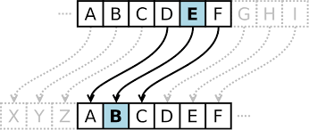
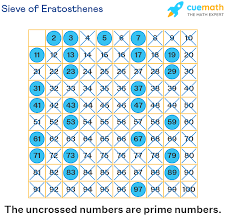
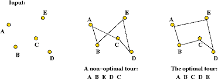
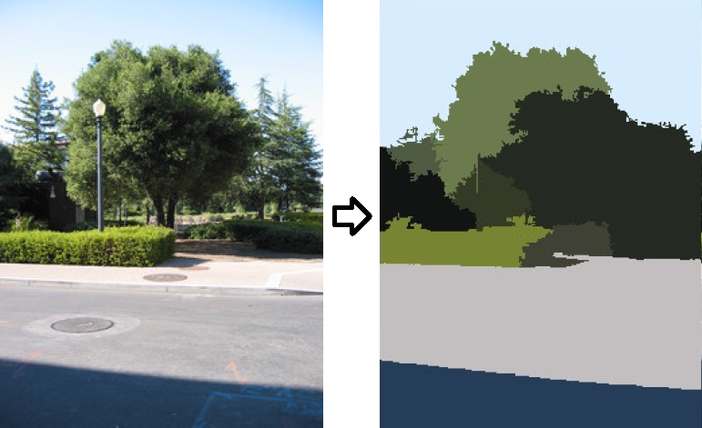

# Notice
1. เนื่องด้วยวิชา software development pratice I ได้เรียนผ่านมานานมากแล้วตั้งแต่ปี 60 แล้วมีการล้างเครื่องโดยในช่วงนั้นยังไม่ได้มีการใช้  version control หรือการ backup ใดๆตัวอย่าง code จึงมีไม่มากเป็นการหาตัวอย่างง่ายๆมา
2. software development pratice I ได้เรียนกับอาจารญ์ วรัญญู โดยจะเน้นงานต่างๆ มากกว่า mini project ใหญ่ๆและจากข้อแรกช่วงเวลาดังกล่าวผ่านมานานมากแล้วจึงจะเล่าถึงงานที่ทำเท่าที่จำความได้

# งานต่างๆ
## Caesar cipher

สร้าง code ขึ้นมาสำหรับทำ caesar cipher โดย caesar cipher นั้นคือการเข้ารหัสโดยทำการ shift ตัวอักษรไปเช่น ABC หาก shift ไป 3 ตำแหน่งจะกลายเป็น DEF
โดย Code ตัวอย่างจะเป็น caesar cipherอย่างง่ายโดยเป็นการ shift แค่ 1 ตำแหน่งโดยใส่ตัวเลขที่ต้องการ shift แต่โจทย์ที่ได้นั้นคือต้องทำให้ key สำหรับ encrypt เป็นคำที่มีหลายตัวอักษรได้เช่น คำว่า ANT จะกลายเป็น key ที่ shift ไป 0,13,19 ตำแหน่งวนไล่ไปตามข้อความโดยทำได้โดยการแปลตัวอักษรเป็น ASCII เป็นเลขเพื่อ shift

## Prime number finder

สร้าง code ขึ้นมาสำหรับหาจำนวนเฉพาะโดย code ตัวอย่างเป็นแบบอย่างง่าย โดยโจทย์นั้นต้องทำการ optimize เพื่อให้ O(n) ต่ำสุด สร้าง UI และ animation พร้อมทั้ง scale ของ UI ตามจำนวนช่วงเลขที่ input

## Traveling saleman problem

สร้าง code การแก้ปัญหา Traveling saleman คือการหาเส้นทางที่สั้นที่สุดในการเดินทางจากจุดที่กำหนดมาให้โดยไม่ทับกัน

### Small scale coordinate
สามารถทำได้โดยการทำ permutation หาความเป็นไปได้ทั้งหมเในการเดินทางหาเส้นทางที่สั้นที่สุด พร้อมทั้งสร้าง animation ระหว่างที่หาเส้นทาง

### Large scale 100+ coordinate
การทำ permutation ไม่สามารถทำได้โดยการใช้ pc ทั่วไปเนื่องจากจำนวนพิกัดมหาศาล ทำให้ความเป็นไปได้มีมากกว่า 100! เครื่องทั่วไปไม่สามารถประมวลผลได้ สามารถแก้ปัญหาได้โดยใช้ greedy algorithm หาเส้นทางที่ใกบ้ที่สุดก่อน พร้อมทั้งสร้าง animation ระหว่างที่หาเส้นทาง

## K means clustering image process

แปลงรูปภาพด้วยสมการ k-mean โดยสมการ k-mean เป็นการเลือกจุด K สำหรับสร้าง cluster ของกลุ่มข้อมูลและเลือกข้อมูลที่เข้าเงื่อนไขสำหรับจุด K นั้นๆเลือกใส่ cluster  แบ่งเป็นกลุ่มข้อมูลตามสมการ แปลง pixle สีรูปเป็นตัวเลขแล้วแบ่งgroupสีด้วยสมการและจัดแบ่ง และสร้างขั้นใหม่ด้วยสีของ group cluster  นั้น
การทำซ้ำจะได้กลุ่มสีที่ละเอียดและหลากหลาย ได้รูปที่มีจำนวนสีมากขึ้น

## Mini project Interactive alram clock
สร้างนาฬิกาปลุกที่ต้องการให้ผู้ใช้งานเล่นเกมเพื่อหยุด พัฒนาโดยใช้ android studio แต่เนื่องด้วยช่วงเวลาที่จำกัดและความไม่ชินในการใช้เครื่องมือ จึงทำได้แค่สามารถเลือกเวลาได้ และส่งสัญญาณเตือนถูกเวลา และลงในมือถือ android ได้
สามารถแสดงชื่อวัน เวลาถูกต้องแต่ยังไม่สามารถตั้งล่วงหน้าหลายๆที หรือมีฟีเจอร์อื่น

